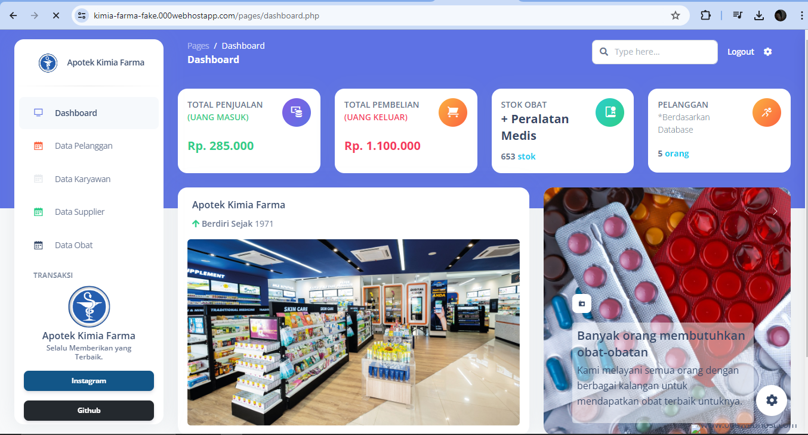

# DASHBOARD APOTEK / `PHARMACY DASHBOARD`

   

This `pharmacy website` is a website created as a website that aims to manage the management of incoming and outgoing goods at a pharmacy that can be used by the admin and owner.

## 📸 Screenshots



## ✨ Features

- Log-In & Sign-In Session
- CRUD table
- Interactive Dashboard
- Tables and related data
- pharmacy resource management

## ✅ Run Locally

Clone the project into a local server like XAMPP or Laragon

```bash
  git clone https://github.com/MuhammadBobby/apotek_kimia_farma.git
```

Go to the project directory

```console
  cd apotek_kimia_farma
```

Open code in IDE like Visual Studio Code

```bash
  code .
```

install database `apotek.sql` into local server with name :

```bash
  apotek
```

Don't forget start the server 🚀

## Demo

https://kimia-farma-fake.000webhostapp.com/

## Username and Password Default

Open Demo Web Dashboard and Log in to the dashboard with the following username and password:

🖋 Username : `ADM101`

📜 Password : `bobby30`

## 🔗 Links

[](https://muhammadbobby.github.io/portfolio-muhammad-bobby/)

[](https://www.linkedin.com/in/muhammad-bobby-oktaviano-1190482ba/)

[](https://www.instagram.com/code.lab_indonesia?igsh=cGs2aGxpYm9sZGw0)

## Authors

- [Muhammad Bobby](https://github.com/MuhammadBobby)
